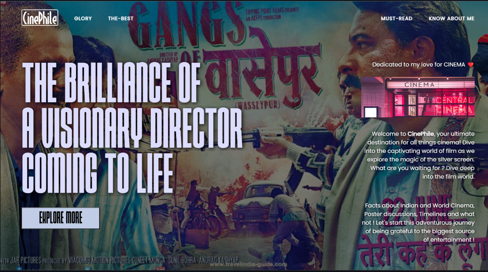

## PROJECT TITLE
The name of this project is : ***CinePhile - PC***

## PROJECT DESCRIPTION
A Website dedicated to my passion for Cinema where I will be adding facts and Info related to Cinema, both from the front and the backside of the Camera. What were the ambitions behind some of the greatest pieces of visual art ? What were the inspirations behind some of the most thought - provoking scenes on the screen ? etc.. 
I will also be expanding this to a complete solution for movie - lovers, including movie recommendation system, personal movies list, etc..
The Website is made to view on larger screens.

## LOCAL DEVELOPMENT
For local development, you just need to 
1. Fork the Repo in GitHub.
2. Go to the folder you want the local clone in.
3. Open Terminal or Command Prompt.
4. Clone the Repo using `git clone https://github.com/Murdock9803/CinePhile-PC.git` command in terminal.
5. Open the `index.html` file or Run the project in Live Server.

## FUTURE GOALS AND ADDITIONS
Some enhancements and additions to be done in this project include (but is not limited to) :
* Personal movie list maker
* Movie Recommendation system based on genre, region, etc..
* Movie Recommendation system based on user's activity (machine learning approach).
* Addition of all `APIs` information related to movies.
* Search Engine library for better searching.

If you have any more ideas or find any errors, you can always raise an [issue here](https://github.com/Murdock9803/CinePhile-PC/issues).
